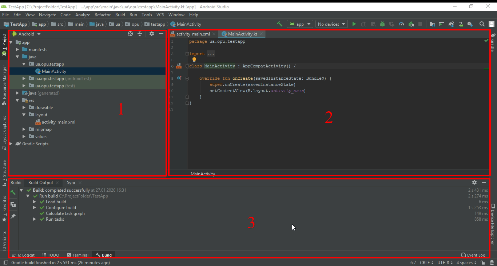

# Android Start
### Guide for noobs.

Открылась среда разработки. Жмем **Start a new Android Studio project.**

В первом окне нам необходимо выбрать устройство, для которого мы создаем новый проект, а также шаблон для стартового окна. Для первого проекта нам необходимо выбрать Empty Activity.

`Name` - имя проекта. Оно будет отображаться в списке проектов при открытии Android Studio. Напишем здесь TestApp.  
`Package name`  – это префикс для имени классов нашего приложения. Как видите, пакет автоматически составился из имени сайта и имени проекта. Его всегда можно отредактировать вручную нажав на ссылку edit справа.  
`Language` - язык программирования это инструмент с помощью которого вы будете говорить компилятору как должно работать ваше приложение. Выбираем Kotlin.  
`Minimum API level` - если нет определенных требований к версии операционной системы, и вы не будете использовать специфические технологии, доступные только в новых версиях операционной системы, то есть рекомендация выбирать версию, которую поддерживает как минимум 85% устройств.
В противном случае выбор версии зависит от требований, предъявляемых к программному обеспечению.

Нажимаем кнопку **Finish**

1. Это область, где вы пишете код. Вы можете открывать несколько файлов одновременно на разных вкладках.  
2. Это та часть, откуда вы можете получить доступ ко всем файлам, присутствующим в вашем проекте.

3. Здесь вы можете увидеть выполняемый в данный момент процесс или действие. Здесь вы можете посмотреть ошибки, если таковые имеются в вашем проекте. А также посмотреть результаты сборки и т.д.

>Во время работы в Android Studio вы подробнее познакомитесь со всеми её возможностями, так что не пугайтесь если на данный момент у вас много вопросов.
