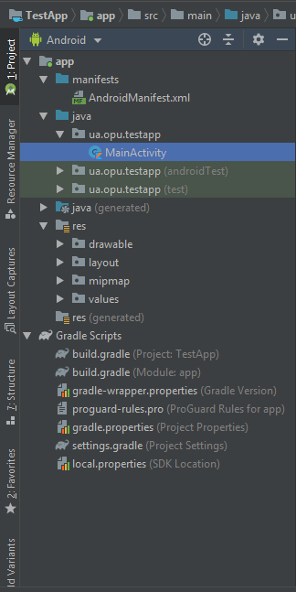
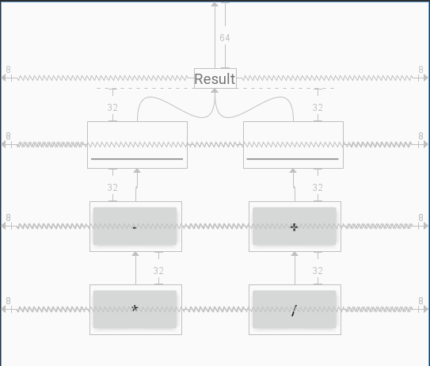
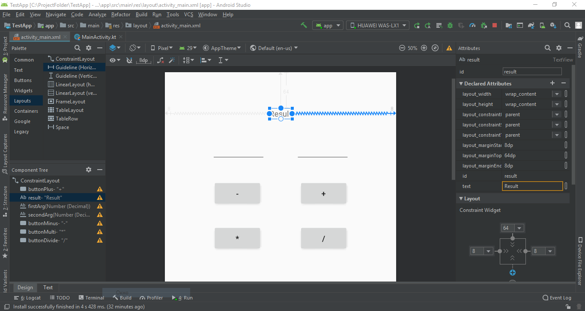

## 1. Установка Android Studio
>placeholder

## 2. Знакомство со средой разработки

Открылась среда разработки. Жмем **Start a new Android Studio project.**

В первом окне нам необходимо выбрать устройство, для которого мы создаем новый проект, а также шаблон для стартового окна. Для первого проекта нам необходимо выбрать Empty Activity.

`Name` - имя проекта. Оно будет отображаться в списке проектов при открытии Android Studio. Напишем здесь TestApp.  
`Package name`  – это поле идентифицирует ваше приложения когда вы размещаете его для пользователей.  
`Language` - выбираем Kotlin.  
`Minimum API level` - если нет определенных требований к версии операционной системы, и вы не будете использовать специфические технологии, доступные только в новых версиях операционной системы, то есть рекомендация выбирать версию, которую поддерживает как минимум 85% устройств. В противном случае выбор версии зависит от требований, предъявляемых к программному обеспечению.

Нажимаем кнопку **Finish**

1. Это та часть, откуда вы можете получить доступ ко всем файлам, присутствующим в вашем проекте. Дальше мы рассмотрим структуру проекта подробнее.
2. Это область, где вы пишете код. Вы можете открывать несколько файлов одновременно на разных вкладках.  
3. Здесь вы можете увидеть выполняемый в данный момент процесс или действие. Здесь вы можете посмотреть ошибки, если таковые имеются в вашем проекте. А также посмотреть результаты сборки и т.д.

>Во время работы в Android Studio вы подробнее познакомитесь со всеми её возможностями, так что не пугайтесь если на данный момент у вас много вопросов.

Для работы с макетами в Android Studio встроен многофункциональный редактор макетов (Layout Editor), который позволит вам удобно конструировать самые разнообразные макеты пользовательского интерфейса.

1. `Область с «виджетами»` – элементы пользовательского интерфейса;
2. `Дерево компонентов` – позволяет легко выбирать элементы и наглядно увидеть иерархию объектов в разметке;
3. `Панель с инструментами` – позволяет изменить размер и тип устройства, язык, версию API, а также содержит другие инструменты;
4. `Визуальное представление(Design)` – так элементы будут выглядеть на экране устройства;  
`Чертеж (Blueprint view)` – специальный вид, который позволяет легко увидеть взаимоотношения и наложения элементов, позволяет выделять невидимые элементы и так далее;
5. `Панель со свойствами` – позволяет изменять свойства выделенного виджета. Изначально представлены основные свойства выделенного элемента, по ссылке внизу можно перейти к отображению всех свойств элемента.

##### 2.1 Структура проекта

Главное, на что следует обратить внимание: проект имеет модульную структуру и основной модуль нашего приложения – `app`.

В папке `app` такие папки: `manifests`, `java`, и `res`.

Раскройте папку `manifests`. Эта папка содержит файл `AndroidManifest.xml`. Этот файл описывает все компоненты приложения Android и считывается системой среды выполнения Android при запуске приложения.  

Раскройте папку `java`. Все файлы кода на языке Котлин и Java организованы здесь. Папка java содержит три подпапки:  

`ua.opu.testapp` (или указанное имя домена): Эта папка содержит файлы исходного кода Котлин и Java для вашего приложения. С этой папкой мы будем работать большую часть времени, поскольку это главный пакет проекта.  

`ua.opu.testapp (androidTest)`: эта папка для размещения инструментальных тестов.

`ua.opu.testapp (test)`: эта папка для размещения модульных тестов.

Подробнее о тестах вы можете узнать из Курса по архитектуре андроид-приложений.

Раскройте папку `res`. Эта папка содержит все ресурсы для вашего приложения, включая изображения, файлы макетов экранов, строковые ресурсы, значки и иконки, цвета и стили оформления. Она включает такие вложенные папки:  

`drawable`: Все изображения для вашего приложения будут сохранены в этой папке.

`layout`: Эта папка содержит файлы макета для активити – экранов приложения.  

В настоящее время ваше приложение имеет одно активити с файлом макета `activity_main.xml`.  

`mipmap`: Эта папка содержит значки запуска приложения – это те значки, которые отображаются на андроид-устройстве после установки приложения.  

`values`: Содержит ресурсы, такие как строки и цвета, используемые в приложении.  

Также в окне структуры проекта есть папка `Gradle Scripts`. Это файлы сборки для системы `Gradle`, которая используется для компиляции, построения и упаковки приложений и библиотек. Больше вам знать на данный момент не нужно.

## 3. Запуск Android приложения

Далее мы попробуем запустить приложение сгенерированное средой разработки.

Для запуска приложения из среды разработки Android Studio мы можем использовать 2 способа:
- подключенный к ПК смартфон или планшет под управлением системы Android;
- эмулятор Android

Если у вас есть смартфон под управлением операционной системы Android, то мы рекомендуем использовать его для запуска и тестирования. В случае, если отсутствует такая возможность или просто хотите попробовать эмулятор - используйте эмулятор.

##### 3.1 Запуск приложения на реальном устройстве

1. Подключите ваш смартфон к компьютеру с помощью кабеля USB. Вам может потребоваться установить соответствующий драйвер USB для вашего устройства.

2. Включите режим `Отладка` через USB на вашем устройстве.

Для того, чтобы узнать как включить отладку на вашем устройстве воспользуйтесь поисковой системой.

Когда ваш телефон будет готов к запуску приложения вы сможете выбрать его в этом списке.

Чтобы запустить приложение из Android Studio:

Откройте один из файлов вашего проекта и нажмите Run app на панели инструментов. Или нажмите комбинацию клавиш Shift+F10.

Android Studio устанавливает приложение на выбранное устройство и запускает его.

Это простое приложение отображает строку «Hello World» на экране виртуального или физического устройства Android.

Вот что у нас вышло.

##### 3.2 Запуск приложения на эмуляторе.

###### Создание виртуального android-устройства (эмулятора)

В Android Studio есть утилита Android Virtual Device (AVD) manager для создания виртуального устройства (также известного как эмулятор), моделирующего конфигурацию определенного типа андроид-устройства.

Первым шагом является создание конфигурации, описывающей виртуальное устройство.

1. В главном меню Android Studio, выберите Tools > Android > AVD Manager, или нажмите иконку AVD Manager в тулбаре нажмите иконку AVD Manager в тулбаре

2. Нажмите кнопку +Create Virtual Device. (Если виртуальное устройство создано ранее, в окне отображаются все существующие устройства и кнопка +Create Virtual Device  находится внизу.) В диалоговом окне Select Hardware отображается список предварительно настроенных типов аппаратных устройств.
3. Выберите устройство, например Nexus 5, и нажмите Next.
4. В окне System Image, на вкладке Recommended, выберите нужную версию.
5. Если ссылка Download  отображается рядом с версией, значит она еще не установлена и требуется загрузить ее. При необходимости щелкните ссылку, чтобы начать загрузку, и нажмите кнопку Next по окончании загрузки.
6. В следующем диалоговом окне примите значения по умолчанию и нажмите кнопку Finish.
7. Если окно Your Virtual Devices AVD Manager еще открыто, закройте его.

###### Возможные проблемы

*Если у вас на компьютере установлена операционная система Windows, а процессор AMD, то скорее всего вы увидите такое предупреждение в окне выбора оборудования для виртуального устройства. Дело в том, что образы виртуальных устройств с типом x86 не работают на связке Windows + AMD. Причем на связке Linux + AMD таких проблем нет. Процессоры Intel поддерживают образы x86 на любой операционной системе. Для Windows + AMD вы можете использовать образы типа arm, но они гораздо более медленные. Выходом будет использование реального устройства – андроид-смартфона или планшета, подключенного к компьютеру.*

*Другой распространенной проблемой является отключенная виртуализация процессора. Включить виртуализацию можно в биосе, в интернете можно найти много инструкций, как это делается.*

*Также нужно в SDK Manager на вкладке SDK Tools установить Intel x86 Emulator Accelerator для лучшей производительности и скорости работы. Только для процессоров Intel.*

*Если в окне выбора системного образа нет активных образов для установки, загрузите образ необходимой версии Android в SDK менеджере. Откройте окно SDK Manager и на вкладке SDK Platforms справа внизу установите флаг Show Package Details для отображения всех компонентов платформы (см. Скриншот 5). Отметьте для загрузки нужный файл System Image. После загрузки выбранный образ будет доступен в окне AVD Manager.установите флаг Show Package Details для отображения всех компонентов платформы.*

###### Запуск приложения на эмуляторе

В Android Studio, выберите в главном меню команду Run > Run app или нажмите иконку Run в тулбаре. нажмите иконку Run в тулбаре
В окне Select Deployment Target, под Available Virtual Devices, выберите только что настроенное виртуальное устройство и щелкните OK.
В зависимости от скорости компьютера это может занять некоторое время. Можно посмотреть в маленькую горизонтальную строку состояния в самом низу окна Android Studio, чтобы увидеть ход выполнения.

После того как приложение будет построено и эмулятор будет готов, среда Android Studio установит приложение в эмулятор и запустит его.

## 4. Создание калькулятора.
При создании приложения на андроид в первую очередь нам нужно сделать макет самого приложения.  

Переходим в app/res/layout и открывает activity_main.  

Android Studio по умолчанию предлагает нам использовать ConstraintLayout при создании разметки экрана. Давайте разберемся, что это за штука и как с ней работать.  

Начнем с самых азов. Чтобы вы могли размещать на экране различные компоненты (кнопки, поля ввода, чекбоксы и т.п.), необходимо использовать специальный контейнер. Именно в него вы будете помещать компоненты. В Android компоненты называются View, а контейнер - ViewGroup.

Существуют несколько типов ViewGroup: LinearLayout, RelativeLayout, FrameLayout, TableLayout, ConstraintLayout и т.д.

Они различаются тем, как они будут упорядочивать компоненты внутри себя. LinearLayout, например, выстроит их по горизонтальной или вертикальной линии. А TableLayout - в виде таблицы.

Убедитесь, что слева-внизу открытка вкладка Design, и режим просмотра выбран Design, а не Blueprint.

Сейчас на экране вы видите текст Hello World. Этот текст отображен с помощью View, которое называется TextView.

Вы можете видеть его в Component Tree (слева-снизу).  

Обратите внимание, что TextView как бы вложен в ConstraintLayout. Это то, о чем я говорил в начале. ConstraintLayout - контейнер, а внутри него находятся различные View, в нашем случае - TextView.  

Давайте удалим TextView с экрана. Для этого просто выделите его на экране или в Component Tree и нажмите кнопку Del на клавиатуре.

Если вы вдруг что-то удалили по ошибке, вы всегда можете восстановить это, нажав Ctrl+Z.

Давайте добавим на экран какой-нибудь компонент, например, снова TextView. Для этого просто перетащите компонент мышкой из Palette на экран.

// TODO: - GIF

Если вы откроете текстовое представление вашего экрана (вкладка Text слева-снизу), то увидите, что элемент TextView подчеркнут красной линией.

Если навести на него мышкой, то он покажет ошибку:
This view is not constrained, it only has designtime positions, so it will jump to (0,0) unless you add constraints.

Этим сообщением студия говорит нам, что View не привязано. Его текущее положение на экране актуально только для разработки (т.е. только в студии). А при работе приложения, это положение будет проигнорировано, и View уедет в точку (0,0), т.е. влево-вверх.

Теперь вернёмся обратно во вкладку Design.

Давайте добавим привязки для нашего TextView.

Если вы выделите на экране TextView, то можете видеть 4 круга по его бока.

Существует два типа привязок: одни задают положение View по горизонтали, а другие - по вертикали.

Создадим горизонтальную привязку. Привяжем положение TextView к левому краю его родителя. Напомню, что родителем TextView является ConstraintLayout, который в нашем случае занимает весь экран. Поэтому края ConstraintLayout совпадают с краями экрана.

// TODO: - GIF

Чтобы создать привязку, нажмите мышкой на TextView, чтобы выделить его. Затем зажмите левой кнопкой мыши левый кружок и тащите его к левой границе.

// TODO: - GIF

TextView также уехал влево. Он привязался к левой границе своего родителя.

Но вовсе необязательно они должны быть вплотную. Мы можем задать отступ. Для этого просто зажмите левой кнопкой мыши TextView, перетащите вправо и отпустите.

Используем верхний кружок и тащим его к верхней границе. TextView привязывается по вертикали к верхней границе родителя. После этого можно перетащить TextView куда вам нужно, чтобы настроить горизонтальный и вертикальный отступы.

Так же вы можете привязывать view к любым другим view.

Чтобы удалить привязку, надо просто зажать ctrl и нажать на соответствующий кружок.

// TODO: - GIF

Наш калькулятор будет состоять из таких view-компонентов - 4 Button, 2 EditText(Number(Decimal)) и 1 TextView.

Компонент EditText — это текстовое поле для пользовательского ввода, которое используется, если необходимо редактирование текста. Его мы будем использовать как поле для ввода значений.

В Android Studio на панели инструментов текстовые поля можно найти в категории Text под разными именами. Нам нужен Number(Decimal).

Давайте добавим все необходимые элементы на экран и свяжем их как на скриншоте

Далее мы изменим id этих view для того чтобы удобно работать с ними в коде и изменим текст кнопок.

Если у вас возникли проблемы или какие-то ошибки - можете подсмотреть код макета тут - [activity_main](https://gist.github.com/607cf3be5aa8e58bfd0deaf466fe21a7)

Теперь у нас есть готовый макет нашего калькулятора, осталось задать функциональность, для этого перейдем в java/ua.opu.testapp/MainActivity.

Нам нужно задать действие, которое будет выполняться при нажатии кнопок, если вы попробуете использовать кнопку из макета в  MainActivity она не будет распознана и подсветится красным, сигнализируя о том, что ее нужно импортировать из другого файла, просто нажмите Alt+Enter и нажмите кнопку "Import", она автоматически импортируется.

Далее через "." мы вызовем  функцию `setOnClickListener`, которая назначит действие при нажатии на кнопку внутри "{ }"

Сейчас мы разберём что тут написали.

Конструкция `if` принимает условие в "(), и если это условие истинно, то выполняется последующий блок инструкций в "{ }".

Если необходимо задать альтернативный вариант, то можно добавить блок else.

В данном случаем нам нужно проверить ввели ли вы оба значения прежде чем пытаетесь вывести результат выражения, используем функцию text, которая получает значение из поля EditText и используем для него функцию `isEmpty()`, которую вызываем у первого и второго аргумента. Если же хоть одно из полей пустое, мы выведем сообщение об ошибке в наше textView. Oператор `||` является логическим "или" и с его помощью мы проверяем сразу 2 аргумента. Еще раз, эти 2 строки:  
`if (firstArg.text.isEmpty() || secondArg.text.isEmpty()) {  
result.text = "Ошибка, вы должны ввести оба значения."
}`  
позволяют нам проверить находится ли что-то в наших полях и если хоть один из аргументов пустой, то в TextView result мы запишем текст с ошибкой.

Если же оба поля для ввода уже заполнены, то выполнится блок else, в котором мы создадим переменную, в которую запишем результат сложения первого и второго аргумента и поместим значение этой переменной в result

Переменная - это контейнер, в который мы можем положить значение. В языке kotlin они бывают изменяемые и не изменяемые. С помощью ключевого слова `val` мы создаем неизменяемую переменную, var- изменяемая. Чтобы создать переменную достаточно указать ключевое слово, название переменной( названия должны быть с маленькой буквы и не содержать в себе цифры/символы) и присвоить ей значение либо же указать тип данных этой переменной. Подробнее про существующие типы данных вы можете почитать [здесь] (https://metanit.com/kotlin/tutorial/2.2.php).

Для того, чтобы произвести операции сложение/вычитания/умножения/деления со значением находящимся во view, нам необходимо сначала преобразовать его в строку, а затем в числовое значение. Для этого нам нужно вызвать функцию `toString()` (преобразовать в строку), а затем `toFloat() `(преобразовать в числовое значение с плавающей запятой).

С помощью знака доллара `$` мы можем поместить в строку значения различных переменных. В нашем случае вместо `$expressionResult` будет вставляться значения этой переменной. При этом переменные необязательно должны представлять строковый тип.

На данный момент, если вы запустите приложение, вы сможете ввести 2 аргумента и посчитать их сумму нажав на плюс. Далее мы сделаем тоже самое с другими кнопками, нужно будет лишь изменить операцию.

Напоследок давайте заблокируем возможность деления на ноль. Для этого нам нужно в условии кнопки деления проверить не является ли значение второго аргумента нулем. Для того, чтобы получить значение и сравнить его с нулем (буква f после числа указывает на тип переменной, а именно - float), нам снова понадобиться преобразовывать его сначала в строку, а затем в число, а так же изменим текст ошибки для этой кнопки.

Если у вас возникли проблемы или какие-то ошибки - можете подсмотреть код приложения тут - [MainActivity](https://gist.github.com/fullmeth/561248068e5dfc5f0f5a0c0f62ce340d)

---
Основной синтаксис:
Для получения дополнительной информации об особенностях и основных
правилах языка Kotlin воспользуйтесь официальным веб-сайтом
разработчиков [Kotlin](https://kotlinlang.org/).
